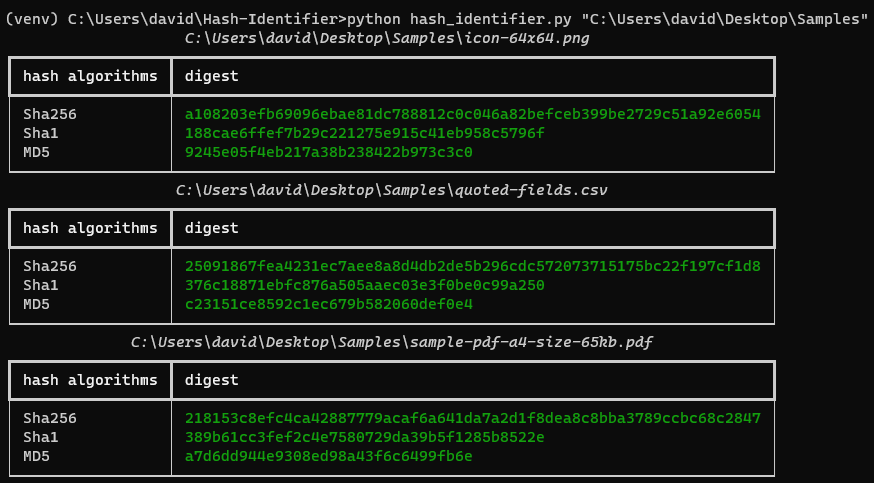
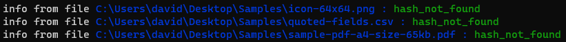

# Hash-Identifier
CLI tool to compute file hashes (SHA-256/SHA-1/MD5) and check them against MalwareBazaar for known malware
# Hash Identifier
 
Command-line tool that computes file hashes (SHA-256, SHA-1, MD5) for one or more files and, optionally, checks them against [MalwareBazaar](https://bazaar.abuse.ch/) to see if they're known malware.
 
## Features
 
- Computes **SHA-256, SHA-1, and MD5** for single files or entire directories
- **Recursive directory scanning** (can be disabled)
- Reads files in chunks, so it can handle large files without loading them entirely into memory
- Output as a **table** (via [rich](https://github.com/Textualize/rich)) or as **JSON**, printed to console or written to file
- **MalwareBazaar lookup**: checks whether a file's SHA-256 hash is already registered as known malware
- Automatically skips symlinks and unreadable files without stopping the scan
## Requirements
 
- Python 3.11+ (required for `hashlib.file_digest` / chunked reading)
- A free [MalwareBazaar](https://bazaar.abuse.ch/) API key if you want to use the `--malware` option
## Installation
 
```bash
git clone https://github.com/<your-username>/hash-identifier.git
cd hash-identifier
python -m venv venv
venv\Scripts\activate
pip install -r requirements.txt
```
 
## Configuration
 
If you want to use the MalwareBazaar check, copy the example file and add your API key:
 
```bash
cp .env.example .env
```
 
Edit `.env`:
 
```
MY_API_KEY=your_api_key_here
```
 
The `.env` file is never pushed to GitHub (it's excluded via `.gitignore`).
 
## Usage
 
```bash
python hash_identifier.py <path> [options]
```
 
### Options
 
| Option | Description |
|---|---|
| `filePath` | Path to a file or directory (required) |
| `--json` | Print results as JSON instead of a table |
| `--output <file>` | Save JSON output to a file (requires `--json`) |
| `-s`, `--no-recursion` | Scan only the given directory, without descending into subdirectories |
| `--malware` | Query MalwareBazaar for every computed SHA-256 hash |
 
### Examples
 
Compute hashes for a single file:
 
```bash
python hash_identifier.py sample.exe
```
 
Recursively scan a directory and print a table:
 
```bash
python hash_identifier.py C:\Downloads
```
 
Scan only the top level, without recursion:
 
```bash
python hash_identifier.py C:\Downloads -s
```
 
Export results as JSON to a file:
 
```bash
python hash_identifier.py C:\Downloads --json --output results.json
```
 
Scan and check every file against MalwareBazaar:
 
```bash
python hash_identifier.py C:\Downloads --malware
```
 
## Sample output
 
**Table:**
 
[]
 
**MalwareBazaar lookup:**
 
[]
 
## Technical notes
 
- Hashes are computed by reading the file in 32 KB chunks, to avoid loading the entire file into memory.
- Unreadable files (permission denied, broken links, files in use) are skipped with a warning, without interrupting the scan.
- Symlinks are ignored to avoid infinite loops in case of recursive links.
- On rate limiting (HTTP 429) from MalwareBazaar, the tool automatically waits and retries.
## Disclaimer
 
This tool is intended for educational and personal analysis purposes. Do not upload sensitive or confidential files to third-party services like MalwareBazaar without proper authorization.
 
## License
 
Distributed under the MIT License. See the `LICENSE` file for details.
 